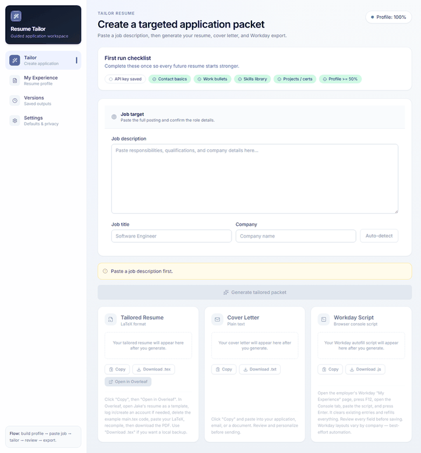
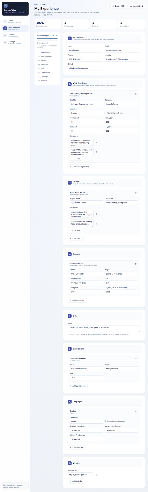
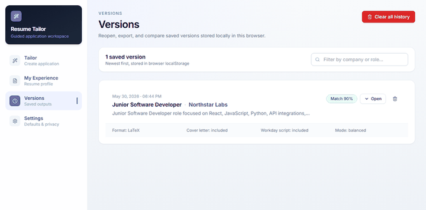
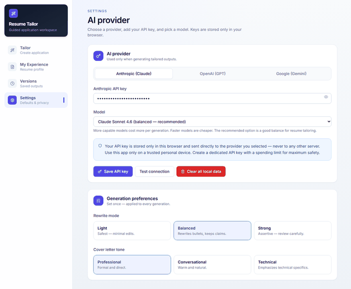

# Resume Tailor

Resume Tailor is a local-first web app for turning one reusable resume profile into targeted job application packets.

You enter your background once, paste a job description, choose generation preferences, and the app creates:

- a tailored LaTeX resume
- a cover letter
- a Workday/autofill helper script
- a saved version you can reopen later

The app runs entirely in the browser. Resume data, generation history, provider settings, and API keys are stored in browser `localStorage`; there is no backend service or shared database in this repository.

## Table of contents

- [Quick start for complete beginners on Windows](#quick-start-for-complete-beginners-on-windows)
- [Screenshots](#screenshots)
- [Features](#features)
- [How the app works](#how-the-app-works)
- [Pages](#pages)
- [Privacy and API keys](#privacy-and-api-keys)
- [Getting started locally](#getting-started-locally)
- [Configuration](#configuration)
- [Development commands](#development-commands)
- [Project structure](#project-structure)
- [Testing and verification](#testing-and-verification)
- [Limitations](#limitations)
- [User guide](#user-guide)

## Quick start for complete beginners on Windows

This section assumes you are on a fresh Windows computer and have never used programming tools before. Follow the steps in order.

You only need to do the download/install steps once. After that, starting the app is just one PowerShell command.

### What you are installing

- **Node.js**: runs the app on your computer.
- **Git**: downloads the app from GitHub.
- **Resume Tailor**: this project.

No backend server, account system, database, or `.env` file is required. Your resume data and API keys stay in your browser's local storage on the current computer.

### Step 1: Install Node.js

1. Open your browser, such as Microsoft Edge or Chrome.
2. Go to: <https://nodejs.org/>
3. Click the **LTS** download button. LTS means the recommended stable version.
4. Open the downloaded installer. It will usually be in your **Downloads** folder.
5. Keep clicking **Next** through the installer.
6. Click **Install**.
7. If Windows asks for permission, click **Yes**.
8. Click **Finish** when it is done.

### Step 2: Install Git

1. Open your browser.
2. Go to: <https://git-scm.com/download/win>
3. The Git for Windows installer should download automatically.
4. Open the downloaded installer from your **Downloads** folder.
5. Keep the default options and click **Next** until you see **Install**.
6. Click **Install**.
7. Click **Finish** when it is done.

### Step 3: Open PowerShell

PowerShell is the Windows app where you paste commands.

1. Click the Windows **Start** button.
2. Type `PowerShell`.
3. Click **Windows PowerShell**.
4. A blue or black command window should open.

Tip: You do not need to run it as Administrator. Normal PowerShell is fine.

### Step 4: Learn how to paste commands into PowerShell

1. Copy a command from this README.
2. Click inside the PowerShell window.
3. Press `Ctrl` + `V` to paste.
4. Press `Enter` to run it.

If `Ctrl` + `V` does not work, right-click inside the PowerShell window instead.

### Step 5: Check that Node.js and Git installed correctly

Copy this entire block, paste it into PowerShell, and press `Enter`:

```powershell
node --version
npm --version
git --version
```

You should see version numbers for all three commands. Example output may look like this:

```txt
v22.12.0
10.9.0
git version 2.47.1.windows.1
```

If PowerShell says a command is not recognized, close PowerShell, open it again, and try the same command one more time. If it still fails, reinstall that tool from the steps above.

### Step 6: Download the app to your Desktop

Copy this entire block, paste it into PowerShell, and press `Enter`:

```powershell
cd $HOME\Desktop
git clone https://github.com/shanjilcoding/resume-tailor-public.git
cd resume-tailor
```

What this does:

- `cd $HOME\Desktop` moves PowerShell to your Desktop folder.
- `git clone ...` downloads the app.
- `cd resume-tailor` opens the app folder in PowerShell.

### Step 7: Install the app's dependencies

Copy this command, paste it into PowerShell, and press `Enter`:

```powershell
npm install
```

This may take a few minutes. You may see a lot of text. That is normal. Wait until PowerShell stops printing new lines and shows the prompt again.

### Step 8: Start the app

Copy this command, paste it into PowerShell, and press `Enter`:

```powershell
npm run dev
```

When it starts successfully, PowerShell will show a local website link. It usually looks like this:

```txt
http://localhost:5173/
```

Open that link in your browser. You can usually hold `Ctrl` and click the link in PowerShell. If that does not work, copy `http://localhost:5173/`, paste it into your browser address bar, and press `Enter`.

Important: keep the PowerShell window open while using the app. If you close PowerShell, the app stops running.

### Step 9: First setup inside the app

1. Open the **Settings** page.
2. Choose your AI provider and model.
3. Paste your provider API key.
4. Click **Save API key**.
5. Click **Test connection**.
6. Open **My Experience** and fill in your reusable resume profile.
7. Open **Tailor**.
8. Paste a job description.
9. Generate the application packet.
10. Review, copy, or download the resume, cover letter, and Workday helper script.

### How to start the app again later

After the first setup, you do not need to download or install everything again.

1. Open **Windows PowerShell**.
2. Copy this block, paste it into PowerShell, and press `Enter`:

```powershell
cd $HOME\Desktop\resume-tailor
npm run dev
```

3. Open the local link shown in PowerShell, usually `http://localhost:5173/`.

### How to stop the app

1. Click inside the PowerShell window that is running the app.
2. Press `Ctrl` + `C`.
3. If PowerShell asks `Terminate batch job?`, type `Y` and press `Enter`.

### Common beginner problems

**PowerShell says `node` or `git` is not recognized**

Close PowerShell and open it again. If it still happens, reinstall Node.js or Git from the links above.

**PowerShell says the `resume-tailor` folder already exists**

That usually means you already downloaded the app. Run this instead:

```powershell
cd $HOME\Desktop\resume-tailor
```

Then continue with:

```powershell
npm install
npm run dev
```

**The browser says the site cannot be reached**

Make sure `npm run dev` is still running in PowerShell. The app only works while that PowerShell window is open.

**The app opens, but generation does not work**

Go to **Settings**, save a valid provider API key, and click **Test connection**. The app can open without an API key, but it cannot generate AI output without one.

## Screenshots

### Tailor workflow



### Resume profile editor



### Saved versions



### Settings



## Features

### Resume profile

- Build a reusable resume source of truth in **My Experience**.
- Store personal info, work experience, projects, education, skills, certifications, languages, and websites.
- Save changes locally in browser `localStorage`, with a visible save confirmation for manual checkpoints.
- Import/export the resume profile as JSON for backup or transfer.
- Temporarily omit specific work, project, education, certification, or language entries from generated outputs without deleting them.
- Collapse large sections and clear sections when rebuilding a profile.
- Track profile completeness so the user knows when the profile is ready for serious tailoring.

### Tailored application packet generation

- Paste a job description and optionally provide job title/company.
- Auto-detect the job title and company from the pasted description.
- Choose which outputs to generate — resume, cover letter, and/or Workday script — with per-output toggles before generating.
- Generate a tailored LaTeX resume from the user's saved profile.
- Generate a cover letter using the selected tone, with an option to regenerate just the cover letter after the packet is created.
- Generate a Workday helper script from the saved profile and tailored bullet output.
- Show estimated API cost for generated packets when provider usage data is available.
- Save each completed generation into local version history.

### Generation preferences

- Select an AI provider and model in **Settings**.
- Save provider-specific API keys locally in the browser.
- Test the provider connection before generating.
- Choose rewrite intensity:
  - **Light** — minimal edits, safest.
  - **Balanced** — stronger rewriting while preserving claims.
  - **Strong** — assertive tailoring that should be reviewed carefully.
- Choose cover letter tone:
  - **Professional**
  - **Conversational**
  - **Technical**

### Versions

- View saved generations newest-first.
- Filter saved versions by role or company.
- Reopen generated outputs.
- See rewrite mode, cover-letter tone, and estimated API cost when available.
- Copy, download, or open outputs from saved history.
- Delete individual versions or clear all history.

### Output tools

Generated outputs are shown in tabs and can be copied or downloaded. The app is designed around LaTeX-first resume output, with an Overleaf-oriented handoff flow. The Workday helper script is best-effort browser automation and should be reviewed before use on any employer site.

## How the app works

1. Fill out **My Experience** with accurate resume facts.
2. Go to **Settings** and add an API key for the provider you want to use.
3. Choose generation preferences such as rewrite mode and cover letter tone.
4. Go to **Tailor** and paste a job description.
5. Generate the application packet.
6. Review the generated resume, cover letter, and Workday script.
7. Reopen prior generations from **Versions**.

The app is intentionally local-first. It does not create accounts, run a server, or sync data to a database.

## Pages

### Tailor

The main workflow page. Use it to paste the target job posting and generate the application packet. You can auto-detect the job title and company from the description, and choose which outputs to generate — resume, cover letter, and/or Workday script — with per-output toggles.

The page checks readiness before generation:

- API key saved
- contact basics completed
- work bullets added
- skills added
- projects/certifications added
- profile strength high enough

Generation is disabled until at least one output is selected and its inputs are present. The resume and cover letter require an API key and a job description; the Workday script is built locally from your profile, so it does not need an API key.

### My Experience

The resume source-of-truth page. This is where the user maintains their reusable background data.

Sections include:

- Personal Info
- Work Experience
- Projects
- Education
- Skills
- Certifications
- Languages
- Websites

This page is not meant to be the final formatted resume. It is the structured profile that the Tailor page uses to generate final application materials. Entries can be temporarily omitted from outputs without deleting the saved source data.

### Versions

The local generation history page. It stores completed application packets in browser `localStorage`, up to the app's history limit.

Use it to:

- reopen previous outputs
- compare saved generations
- download or copy older output
- delete stale versions

### Settings

The configuration page.

Use it to:

- select the AI provider
- select the model and see rough per-application cost estimates
- save the provider API key
- test the provider connection
- choose rewrite mode
- choose cover letter tone
- clear all local data

## Privacy and API keys

Resume Tailor is local-first, but it does call the selected AI provider when the user generates or tests a connection.

Important notes:

- API keys are stored in browser `localStorage` on the current device/browser.
- Resume profile data is stored in browser `localStorage`.
- Version history is stored in browser `localStorage`.
- Generated requests are sent directly from the browser to the selected AI provider.
- There is no app-owned backend in this repository.
- Do not use the app on an untrusted/shared computer.
- Prefer a dedicated provider API key with a spending limit.
- Never commit real API keys to GitHub.

## Getting started locally

For a beginner-friendly Windows setup, use the full [Quick start for complete beginners on Windows](#quick-start-for-complete-beginners-on-windows) above.

For people already comfortable with Node.js, Git, and a terminal:

```bash
git clone https://github.com/shanjilcoding/resume-tailor-public.git
cd resume-tailor
npm install
npm run dev
```

Open the Vite URL shown in the terminal, usually:

```txt
http://localhost:5173/
```

Build and preview commands:

```bash
npm run build
npm run preview
```

## Configuration

Configuration is done from the **Settings** page in the browser.

Typical first setup:

1. Open the app locally.
2. Go to **Settings**.
3. Choose your AI provider.
4. Select a model.
5. Paste your API key.
6. Click **Save API key**.
7. Click **Test connection**.
8. Pick rewrite mode and cover letter tone.
9. Go to **My Experience** and complete your profile.
10. Go to **Tailor** and generate your first packet.

No `.env` file is required for the browser app.

## Development commands

```bash
# Install dependencies
npm install

# Start local dev server
npm run dev

# Lint the codebase
npm run lint

# Run unit tests
npm test

# Build production assets
npm run build

# Preview production build
npm run preview

# Check production dependency vulnerabilities
npm audit --omit=dev
```

## Project structure

```txt
resume-tailor/
├── src/
│   ├── App.jsx                  # App shell and page navigation
│   ├── main.jsx                 # React entrypoint
│   ├── components/              # Shared UI components
│   │   ├── Button.jsx
│   │   ├── Card.jsx
│   │   ├── CompletenessBar.jsx
│   │   ├── Input.jsx
│   │   ├── OutputTabs.jsx
│   │   ├── Textarea.jsx
│   │   └── Toast.jsx
│   ├── lib/                     # Generation, storage, validation, export helpers
│   │   ├── api.js
│   │   ├── detect.js
│   │   ├── download.js
│   │   ├── latex.js
│   │   ├── pricing.js              # Provider/model cost estimates
│   │   ├── storage.js
│   │   ├── validation.js
│   │   ├── workday.js              # Active Workday helper script generator
│   │   └── workday.stable.js       # Backup Workday script kept for rollback/reference
│   └── pages/
│       ├── Generator.jsx        # Tailor page
│       ├── History.jsx          # Versions page
│       ├── MyExperience.jsx     # Resume profile/source-of-truth page
│       └── Settings.jsx         # Provider and generation settings
├── docs/
│   ├── screenshots/             # README screenshots with demo data
│   └── USER_GUIDE.md            # End-user walkthrough
├── AGENTS.md                    # Guidance for AI agents working in this repo
├── package.json
└── README.md
```

## Testing and verification

Before shipping a code change, run:

```bash
npm test
npm run build
```

Recommended manual QA:

1. Open the app in a browser.
2. Check **Tailor**, **My Experience**, **Versions**, and **Settings**.
3. Confirm there are no browser console errors.
4. Confirm local data saves after reload.
5. Confirm JSON export/import still works.
6. Confirm generation is disabled until required inputs are present.
7. With a test API key, run a provider connection test.
8. With a complete enough profile and a job description, generate a packet and confirm it appears in **Versions**.

## Limitations

- This is a browser-only app; there is no backend, account system, or cloud sync.
- Data is tied to the browser/device unless exported as JSON.
- Clearing browser storage can delete the saved profile, settings, and history.
- Provider APIs, model names, CORS behavior, and pricing can change over time, so cost estimates are approximate.
- AI-generated output should always be reviewed before sending to an employer.
- Strong rewrite mode can be useful, but it requires careful fact-checking.

## User guide

For a step-by-step end-user walkthrough, see:

[docs/USER_GUIDE.md](docs/USER_GUIDE.md)

## License

No license has been added yet. Add one before distributing the project publicly if needed.
